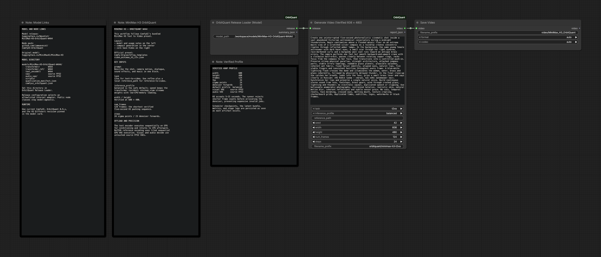

# MiniMax H3 OrbitQuant — ComfyUI and efficiency proof

The public MiniMax H3 W4A4 release runs through current ComfyUI on CUDA 13.
The public surface stays model-agnostic: `OrbitQuant Release Loader` selects an
allowlisted adapter from the release config, while `OrbitQuant Generate Video`
returns ComfyUI's standard `VIDEO`. There are no MiniMax-specific public nodes.



This 3060×1310 PNG was produced by the ComfyUI Workflow Image Export action,
not by taking a browser screenshot. Its `tEXt` `workflow` chunk contains the
same six-node, two-link graph with `balanced`, 608×480, 124 frames, 24 sigma
points, and the 1,909-character conservatory prompt. The PNG was imported back
into the live frontend with no missing nodes.

## Public workflow

- [Loadable ComfyUI workflow](workflows/minimax-h3-t2va-ui.json)
- [API prompt exported from the live graph](workflows/minimax-h3-public-ui-api.json)
- [T2VA API proof workflow](workflows/minimax-h3-t2va-api.json)
- [Ref2VA API proof workflow](workflows/minimax-h3-ref2va-api.json)
- [Machine-readable report](report.json)
- [Publication audit](publication.json)

The layout and documentation structure follow Comfy-Org's bundled
[`video_minimax_h3_t2v.json`](https://github.com/Comfy-Org/workflow_templates/blob/7653f1cdef1d92394b6ef9946018c0a8aa4136b8/templates/video_minimax_h3_t2v.json):
model links and usage notes on the left, a compact loader/generator path in the
middle, and core `SaveVideo` on the right.

## Verified 24-point recipes

Every retained endpoint uses 608×480, 124 frames at 24 FPS, 24 sigma points / 23
denoiser forwards, native packed W4A4 in all 300 eligible modules, native-auto
Torch Flash SDPA, no exact INT8 weight cache, sequential CUDA text conditioning,
and untouched source FP32 visual/audio VAEs.

| Profile | GPU | Task | Placement | Process peak | Denoise | Generation |
| --- | --- | --- | --- | ---: | ---: | ---: |
| `balanced` | RTX PRO 6000 | T2VA | streamed leaf, 12 GiB allocator cap | 6.36 GiB child; 6.90 GiB incl. idle ComfyUI | 46.68 s | — |
| `speed` | RTX PRO 6000 | T2VA | resident transformer | 21.14 GiB | 46.84 s | 51.10 s |
| `minimum_vram` | RTX 4090 | T2VA | low-CPU-memory streamed leaf, 8 GiB cap | 4.07 GiB | 154.25 s | 188.70 s |
| `speed` | RTX PRO 6000 | Ref2VA | resident `transformer_ref` | 24.06 GiB | 118.48 s | 155.42 s |

The final live ComfyUI `balanced` run completed through `/prompt` as
`b23d25f6-3b6c-4be5-89c7-b3f2604159d0`. Its API harness returned terminal
`pass` after 105.09 seconds including load, generation, source-FP32 tiled
decode, encode, and artifact transfer. The generator's own live PyTorch peak
was 1.99 GiB; a separate physical-device monitor measured about 6.36 GiB for
the child and 6.90 GiB including ComfyUI's idle CUDA context.

The `balanced` and `minimum_vram` recipes use the OrbitQuant 0.9.2
derived-buffer identity fix so Diffusers streamed offload does not replace
registered buffer objects. On the RunPod ComfyUI image the live proof used:

```bash
python main.py --listen 0.0.0.0 --port 8188 \
  --disable-cuda-malloc \
  --disable-dynamic-vram \
  --disable-async-offload
```

Those supported flags isolate the generator's bounded allocator from ComfyUI's
global cudaMallocAsync, DynamicVRAM, and async-offload hooks. Without that
isolation, the image's global memory layer reserved almost the complete 96 GiB
device despite only about 2 GiB of live generator tensors.

## Final reviewed media

- Balanced live ComfyUI: [CRF 1 yuv444p master](media/masters/comfyui-balanced-t2va-608x480-crf1.mp4) · [H.265 CRF 10](media/hevc/comfyui-balanced-t2va-608x480-crf10.mp4) · [H.264 preview](media/h264/comfyui-balanced-t2va-608x480.mp4) · [16-frame overview](media/timelines/comfyui-balanced-t2va-608x480.jpg)
- Review evidence: [adjacent triplets](media/review/comfyui-balanced-adjacent-triplets.jpg) · [full-resolution frame 120](media/review/comfyui-balanced-frame-120.png) · [audio spectrum](media/review/comfyui-balanced-audio-spectrum.png)
- Earlier full task proof: [T2VA HEVC](media/hevc/comfyui-t2va-608x480.mp4) · [Ref2VA HEVC](media/hevc/comfyui-ref2va-608x480.mp4)

The final master and both delivery encodes probe as 608×480, 124 frames, 5.175
seconds, and AAC stereo at 32 kHz. The master is H.264 CRF 1 yuv444p; the card
copy is 10-bit HEVC CRF 10; the Comfy preview is H.264 yuv420p. Source FP32
visual decode took 31.00 seconds with a 1.025 GiB PyTorch peak. Audio decode
took 0.177 seconds; the waveform standard deviation is 0.175.

All frames, full-resolution end frames, and adjacent temporal triplets were
reviewed for face geometry, aligned eyes and lips, grid artifacts, ghosting,
texture breakup, and section-boundary redraw. The shot remains coherent through
the compass macro, backward crane/orbit, and final face push. The spectrum is
broadband with no persistent narrow high-frequency whistle, and the audio has
no NaNs, infinities, or clipping failure.

## Exact environment

- ComfyUI `9a9fdb10ed144ce760d9682cb247526ea23cc525`
- ComfyUI frontend `1.47.12`
- ComfyUI-OrbitQuant delivery branch `main`
- OrbitQuant `0.9.2` / `cd58b4ecf77f22b8c4116b3d0b7d4af258e16ba3`
- Diffusers `abc5e9bf71fd38f53cd471bc3acaa84bc5ecbfdc`
- Source MiniMax H3 `73372e6cf53e414edd3ab03e357717fb0602e758`
- RunPod ComfyUI image with CUDA 13.0
- NVIDIA RTX PRO 6000 Blackwell Workstation Edition and RTX 4090

The Hugging Face publication is audited independently in
[`publication.json`](publication.json): latest published revision, anonymous
model-page access, ranged media access, exact file count/byte total, and absence
of cache or bytecode files.
